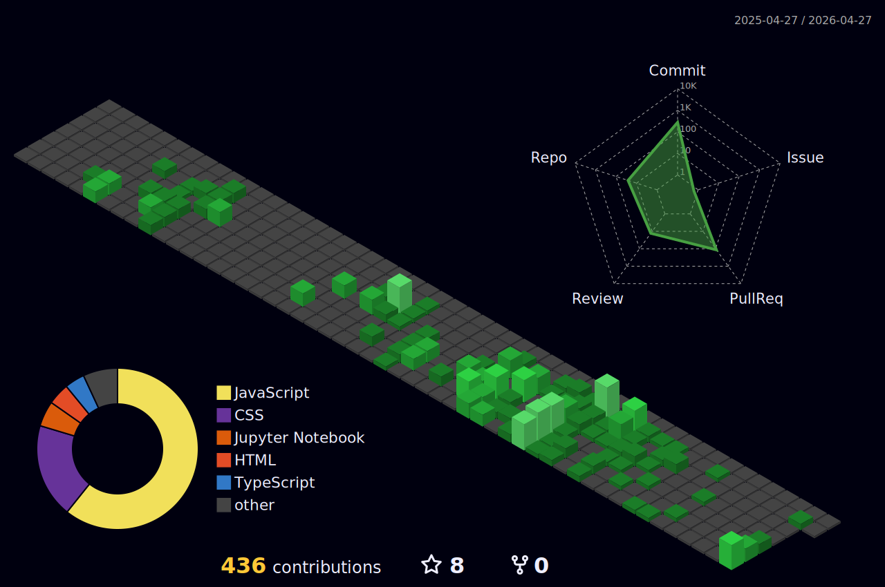

  

 |  |  |
 | :-: | :-: |
---

## 🛠 Tech Stack (Módulos Ativos)

### 💻 Frontend & Styling

  

 

### ⚙️ Backend & Infra

  

### 🔧 Workspace & Tools

  

---

## 🌐 Conexão Neural (Redes Sociais)

  
  
  
  

  

  Operação executada por <b>Kleber Gonçalves</b>. © 2026

